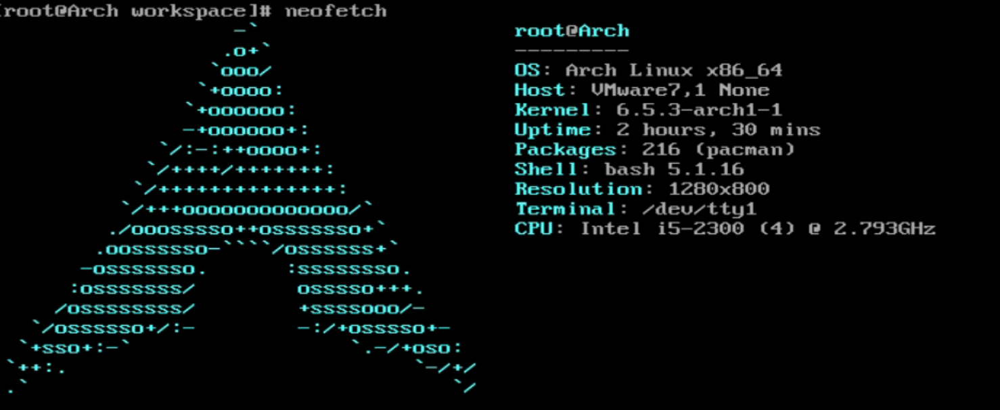
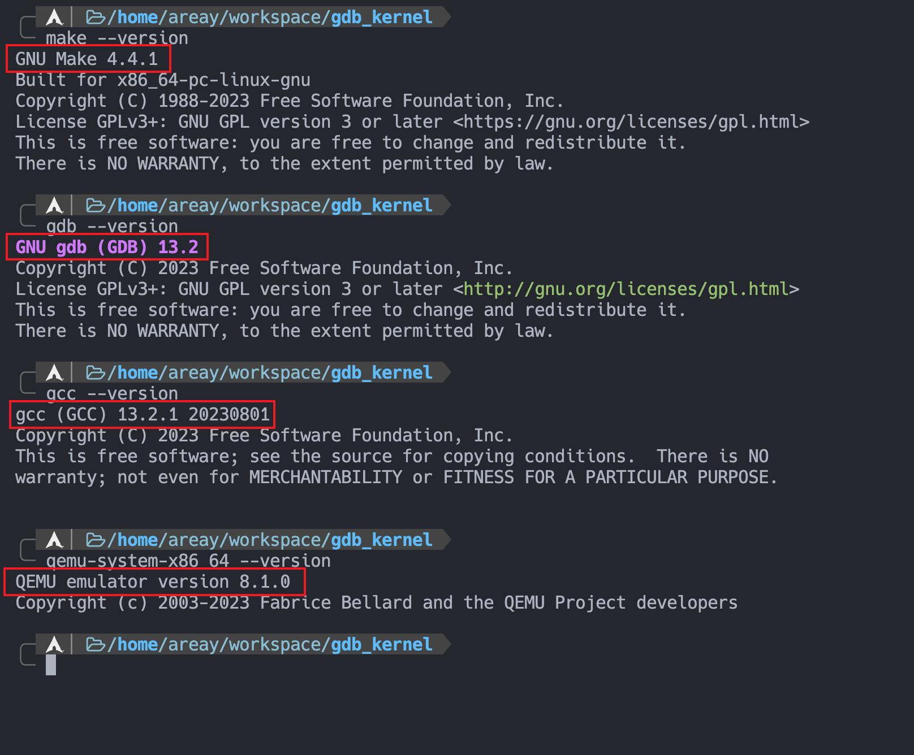
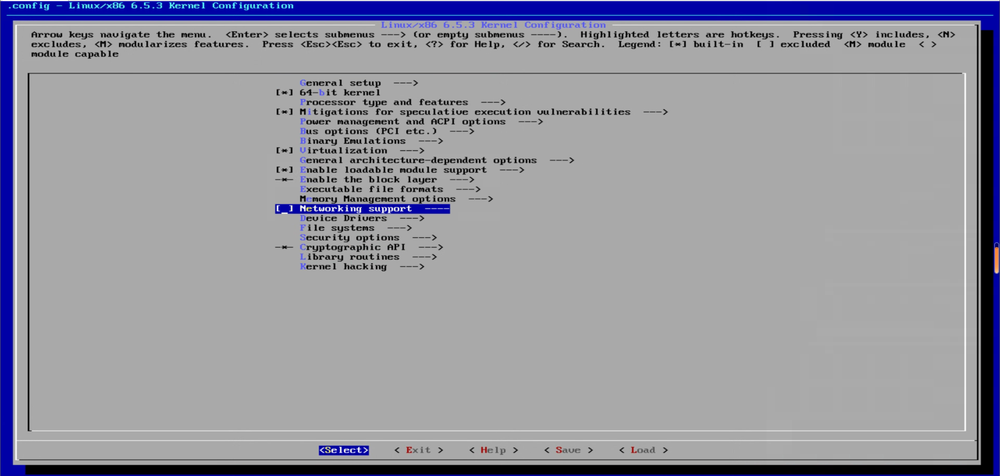
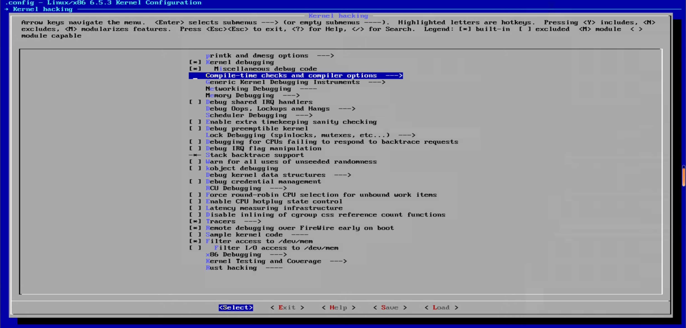
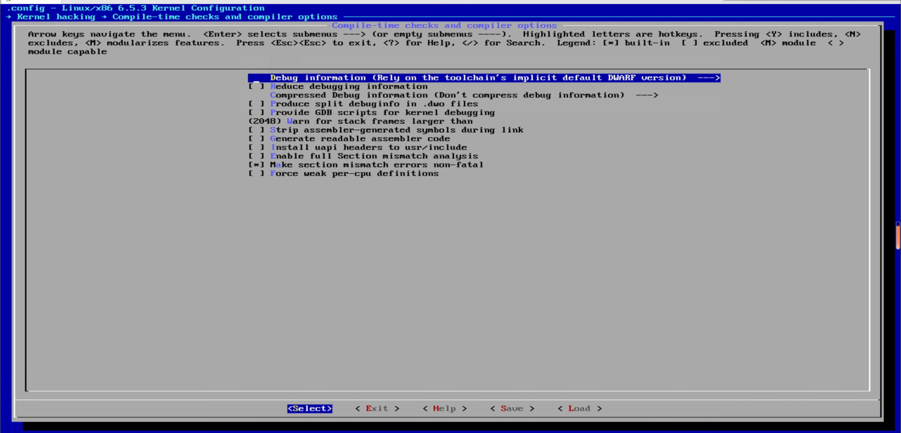
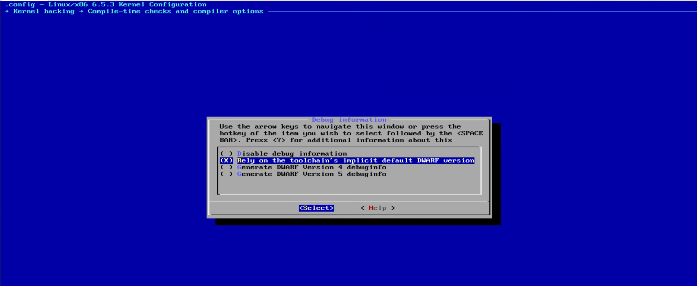
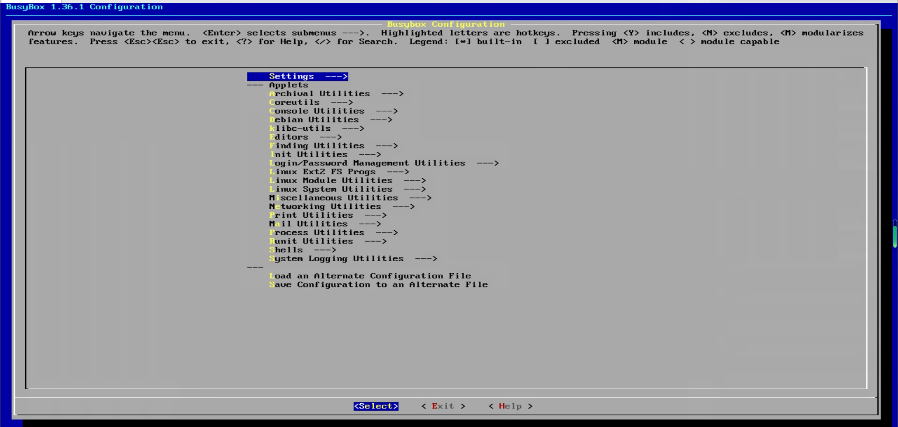
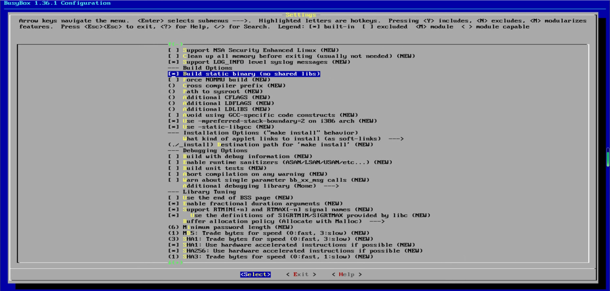
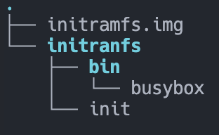
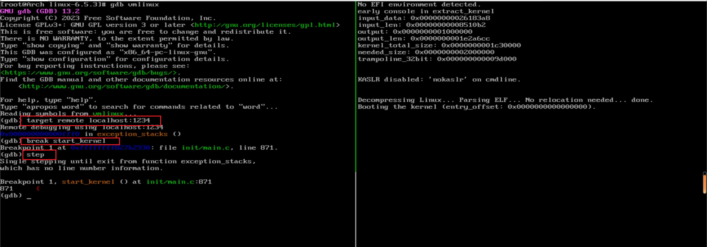

title: 关于如何在 Arch Linux 搭建一个 gdb + qemu 调试 Linux 内核

## Arch Linux搭建一个gdb+qemu调试Linux内核

##
### ！！！注意！！！

### 只需要按照步骤从上往下，即可成功配置调试环境(部分有图解)
### ！！！！！(全程在虚拟机的Arch Linux环境下)！！！ ！！
##

### Arch Linux 安装指南：
- <https://wiki.archlinux.org/title/Installation_guide>

### 系统基本信息：



### 调试内核需要准备：
- 镜像
   - bzImage (x86_64) (这是内核的主要二进制映像文件，通常是Linux内核的可执行文件)
   - initramfs.img (这是一个初始的根文件系统映像，通常包含一些必要的文件和工具，以便在启动时内核能够正确运行)
- gdb
   - x86_64版本 (version 13.2)
- QEMU
   - qemu-system-x86_64 (version 8.1.0)

### 附上编译成功的各软件版本信息：
- GUN Make
	- version 4.4.1
- GNU gdb
	- version 13.2
- gcc
	- version 13.2.1
- QEMU
	- version 8.1.0


#### 首先安装所需要的软件包(全程在虚拟机的Arch Linux环境下)：
```shell
sudo pacman -Sy  gcc make flex bison bc sed cpio wget qemu gdb
```
 

#### 创建工作区并且进入： 
``` shell
mkdir ~/workspace/ && cd ~/workspace/
```

#### 下载Linux-6.5.3版本内核源码：
 ```shell
wget https://cdn.kernel.org/pub/linux/kernel/v6.x/linux-6.5.3.tar.xz
```

#### 解压：
```shell
tar -xf linux-6.5.3.tar.xz
# -x： 表示提取文件 
# -f： 后面跟着要提取的文件名
```
#### 进入解压好的文件:
```shell
cd ~/workspace/linux-6.5.3
```

#### 清除配置 并且 配置内核编译选项：
```shell
make mrproper && make menuconfig
# y：打勾  n：取消勾   enter：进入
# 取消勾选 Networking support
# 进入 Complie-time checks and compiler options
# 进入 Debug information
# 勾选 Rely on the toolchain's impicit default DWARF version
# 保存退出
```






#### 多线程编译：
```shell
make -j 20
```

#### 创建文件夹并且进入：
```shell
mkdir ~/workspace/file && cd ~/workspace/ file
```

#### 下载busybox源码：
```shell 
wget https://busybox.net/downloads/busybox-1.36.1.tar.bz2
```

#### 解压：
```shell
tar -xf busybox-1.36.1.tar.bz2
# -x： 表示提取文件 
# -f： 后面跟着要提取的文件名
```

#### 进入解压完成的busybox文件夹：
```shell 
cd busybox-1.36.1
```

#### 清除配置 并且 配置busybox编译选项： 
```shell
make mrproper && make menuconfig
# 进入 Settings
# 勾选 Build static binary (no shared libs)
```



#### 多线程编译 并且 安装：
```shell
make -j 20 && make install
```

#### 创建 initramfs 文件夹 并且 进入：
```shell
mkdir ~/workspace/initramfs/ && cd ~/workspace/initramfs/
```

#### 目录结构为：


#### 创建 bin 文件夹 并且 进入：
```shell
mkdir bin && cd bin
```

#### 拷贝 busybox 二进制可执行文件 到 当前路径：
```shell
cp ~/workspace/file/busy-1.36.1/_install/bin/busybox .
```

#### 返回 上级 文件夹 并且 新建 init 文件：
```shell 
cd .. && touch init
```

#### vim 编辑 init 文件：
```shell
vim init
# 按 i 插入
# 按 ESC  输入 :wq  保存退出
```
#### 按 i 插入以下内容：
```shell
#!/bin/busybox sh

/bin/busybox echo "Welcome to Linux"

/bin/busybox sh
```
```
补充(不需要插入该内容)：这是一个简单的Shell脚本，它使用了BusyBox工具。
这个脚本的功能是在终端上显示欢迎消息 "Welcome to Linux"，
然后启动一个新的BusyBox shell，使用户可以在其中输入其他命令。
```


#### 给 init 文件加执行权限 并且 进入 initramfs 文件夹：
```shell
chmod +x init && cd ~/workspace/initramfs
# chmod +x 这个命令给名为"init"的文件添加了可执行权限
```

#### 创建 initramfs.img 镜像：
```shell
find . -print0 | cpio -ov --null --format=newc | gzip -9 ../initramfs.img
# -print0：使用 null 字符（而不是换行符）分隔输出
# -o：创建归档
# -v：详细模式，显示文件被归档时的名称
# --null：使用以 null 结尾的文件名（与 find -print0 的输出格式相匹配）
# --format=newc：指定归档格式为 newc
# -9： 以最大的压缩级别（-9）压缩 cpio 归档
```

#### 将 bzImage 拷贝 到与 initramfs.img 同一文件夹下:
```shell
cp ~/workspace/linux-6.5.3/arch/x86_64/boot/bzImage ~/workspace/
```

```shell
cd .. && vim Makefile
```

#### 以下为 Makefile 文件内容：
```Makefile
run:
	qemu-system-x86_64 \   # QEMU 的命令行工具，用于启动 x86_64 架构的虚拟机
		-kernel bzImage \  # 指定要在虚拟机中加载的内核镜像文件
		-initrd initramfs.img \ # 指定要用作 initramfs 的初始化 RAM 磁盘（ramdisk）映像文件
		-m 256M \ # 设置虚拟机的内存大小为 256 兆字节
		-nographic \ # 告诉 QEMU 在纯文本终端上运行虚拟机，而不是使用图形用户界面（GUI）
		-append "earlyprintk=serial,ttyS0 console=ttyS0 nokaslr" \ # 传递给内核的命令行参数 具体在下方
		-S \ # 告诉 QEMU 在启动时暂停虚拟机，等待 GDB 连接
		-s   # 告诉 QEMU 打开一个 GDB 服务器,可以连接 GDB 调试器来调试内核（默认端口：1234）
# 按 i 插入
# 按 ESC  输入 :wq  保存退出 
# earlyprintk=serial,ttyS0：这个参数指示内核在早期使用串行控制台 ttyS0 输出调试信息
# console=ttyS0：这个参数告诉内核将系统控制台设置为串行控制台 ttyS0
# nokaslr：这个参数禁用内核地址空间随机化布局 (ASLR)
```

#### 开启调试：
```shell
make run
```


#### 打开另一个终端：
```shell
cd ~/workspace/linux-6.5.3 && gdb vmlinux
# 进入工作区 开启 gdb 调试
```

#### gdb 连接本机 1234 端口进行调试：
```shell
target remote localhost:1234
```

#### gdb命令：在start_kernel函数处打下断点
```shell
break start_kernel
```

#### gdb命令：进入调用的函数内部
```shell
step
```
#### 至此可以利用gdb愉快的调试Linux内核了！


#### 更多gdb调试信息请查看官方文档：
- <https://sourceware.org/gdb/documentation/>


